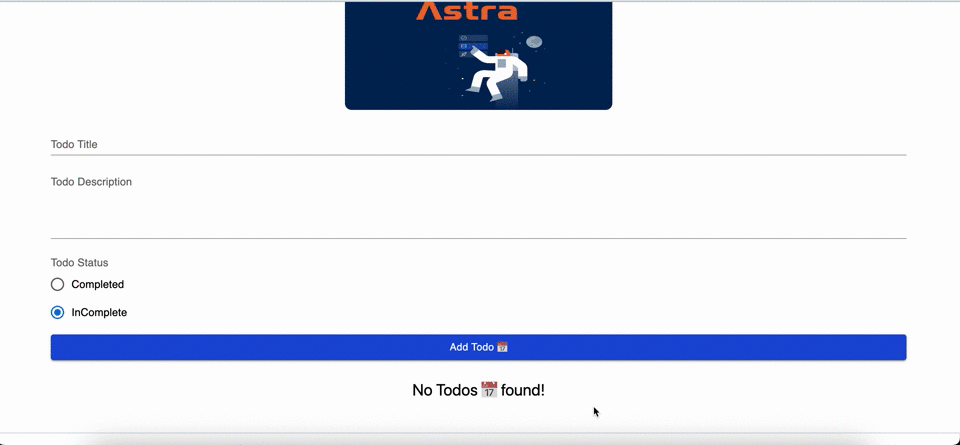

# How to perform CRUD operations with serverless Astra DB and Next JS(Front-End) to build a Full Stack Todo App

Hi fellow developers and database enthusiasts, today I would like to share a step-by-step guide following which you will be able to understand and use **Apache Cassandra** along with **NextJS13** in your projects.

# Table of Contents

1. **Getting Started**
2. **What We Are Going to Build?**
3. **Technologies We Are Going to Use**
4. **Are Apache Cassandra and Serverless Astra DB Different?**
5. **Pre-requisites for Following This Article**
6. **Introduction to Cassandra**

   - I. How Cassandra Was Innovated
   - II. Cassandra Usage At Big Tech Companies
   - III. Features of Cassandra
   - IV. How Cassandra Works
   - V. How Cassandra Replicates Data
   - VI. How Data is Structured in Cassandra
   - VII. Let's Understand Through an Example How Cassandra is Structured

7. **Creating a New Astra DB Database**
8. **Using CQL Shell to CREATE TABLE "todos" and Insert Some Data**

   - I. Opening the CQL Console
   - II. Creating Table "todos" Using the CQL Console
   - III. Inserting Some Data into the "todos" Table
   - IV. Viewing the "todos" Table Data in CQL Console

9. **Creating a New NextJS (Front-End) Project**
10. **Writing the NextJS APIs to Interact with Astra DB**

- I. GET Request
- II. POST Request
- III. PUT and DELETE Requests

11. **Testing the Astra DB APIs**
12. **Writing the Front-End Part of the Todo App**

- I. Writing the Components
  - a) TodoList ⌚️
  - b) SnackBar 🔔
  - c) Footer ℹ️
  - d) Creating the Types of Components
- II. Creating the Todo App Pages

13. **Starting Our Project**
14. **Conclusion**

<br/>
<hr/>
<br/>

# <u>1- Getting Started With Repo</u>

First Clone the repo

```bash
git clone https://github.com/Muhammad-Bilal-7896/CRUDCassandraDBNextJS
```

Then install the dependencies

```bash
npm install
```

Then create a `.env.local` file in the root directory and add the following

```bash
REACT_APP_ASTRA_DB_ID=70271e02-9616-4b61-8902-f8cd73d5b470
REACT_APP_ASTRA_DB_REGION=us-east1
REACT_APP_ASTRA_DB_KEYSPACE=live_coding
REACT_APP_ASTRA_DB_TOKEN=AstraCS:UMHldokDeYIhSkNHRHDuIShI:71cef8c7f57909521b2eb550d593e8cf0bc399521633e8fc5c525fa8ee2cb928
```

Then run the development server:

```bash
npm run dev
# or
yarn dev
# or
pnpm dev
```

Open [http://localhost:3000](http://localhost:3000) with your browser to see the result.

For detailed explanation on how I built this app, read below.

# <u>2- What We Are Going to Build?</u>

We are going to build a simple todo app that will use Apache Cassandra to store the todos, and addition, deletion, and update of todos will be handled by Apache Cassandra.

We will discuss the following in detail:

- Overview of Apache Cassandra
- Cassandra Data Modeling
- Cassandra DB Structure
- Creating a new serverless Astra DB Database and utilizing its API using NextJS that will perform CRUD (create, read, update, delete) operations utilizing Astra DB
- Build a front end using Next JS to utilize that API

At the end of the article, we will be ready with a full stack Cassandra DB todo app. I will do everything from scratch so that every beginner can understand, and everything will be step by step.

# <u>3- Technologies We Are Going to Use</u>

- **Database**: Apache Cassandra, Astra DB
- <b>Front End</b>: Next JS
- <b>UI Libraries</b>: Material UI, Tailwind CSS
- <b>Language</b>: TypeScript

This project will not only add a new <b>database skill</b>, but you will also learn how to develop and use <a>AstraDB</a> with a <b>front end (NextJS)</b>. I hope you will be able to follow everything step by step. Otherwise, if you face any difficulty, you can always reach out to me or comment on the post. I will be happy to help you resolve the issue.



A full stack Next js + Cassandra Db <a target="_blank" href="https://astratodo.vercel.app/">Todo app</a> that will perform all major <b>AstraDB database</b> functions this guide is designed for this purpose. <br/>
<u>Live Astra DB Todo App:</u> <a target="_blank" href="https://astratodo.vercel.app/">Todo app</a> <br/>
<u>Github Source Code:</u> <a target="_blank" href="https://github.com/Muhammad-Bilal-7896/CRUDCassandraDBNextJS">Source Code</a>

# <u>3- Are Apache Cassandra and Serverless Astra DB Different?</u>

**Astra DB** is a serverless database like Firebase that is built using **Apache Cassandra** and is fully hosted and managed by **DataStax** so developers can easily use it without building the backend. So it can be used on the front end without building the API just as if any of you have used Firebase, Astra DB by DataStax is similar to that. <br/>
Cassandra DB is a free and open-source, distributed, wide-column store, NoSQL database management system designed to handle large amounts of data across many commodity servers, providing high availability with no single point of failure. <br/>
We will be using **Astra DB** provided by **DataStax** to use **Cassandra DB** throughout this article.

# <u>4- Pre-requisites for following this article</u>
<p>
1. JavaScript basic knowledge
2. Rest API's basic knowledge
3. NextJS basic concepts
4. NodeJS basic knowledge 
<br/> 
Now let's first understand what is <i>Cassandra</i>
<br/>

# <u>5- Introduction to Cassandra</u>
> <i>"Cassandra is an open source and free database written in java and is a wide column store nosql database famous for its ability to distribute petabytes of data with unmatched reliability and performance".</i>